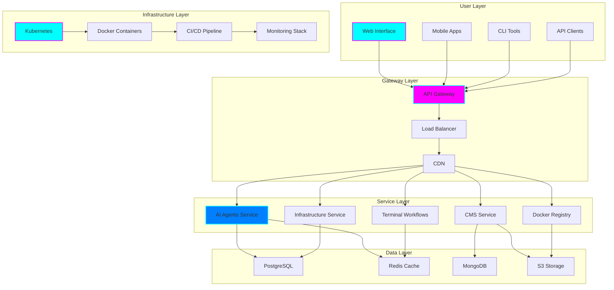
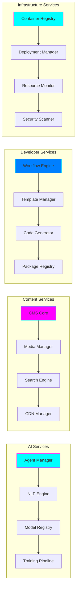
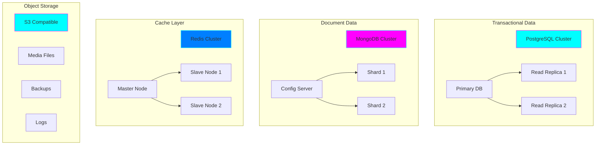
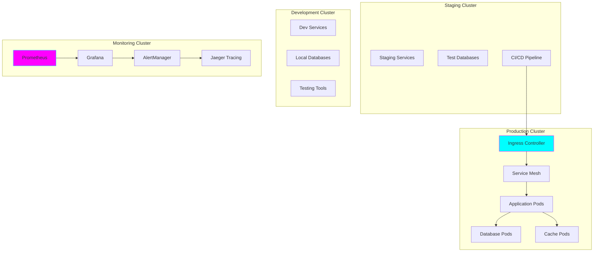
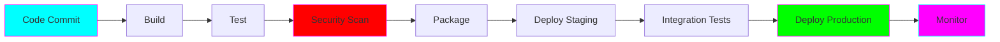
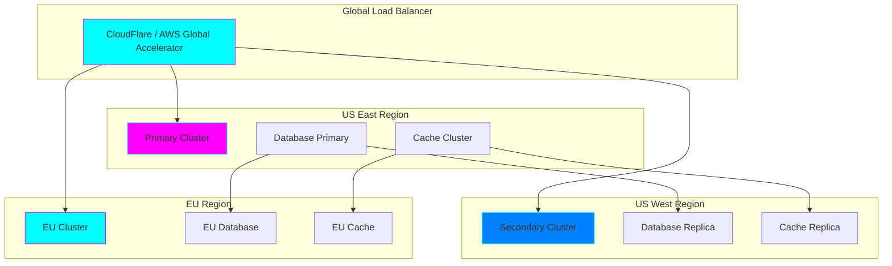
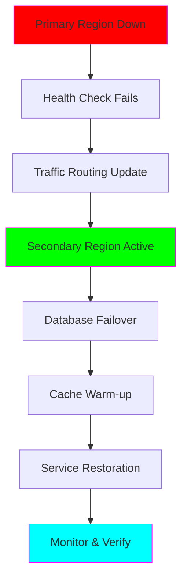
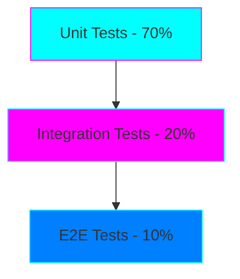

# Architecture Documentation

**Comprehensive system architecture for the Tiation ecosystem**

*Professional • Scalable • Mission-Driven*

---

## 🎯 Overview

The Tiation ecosystem is designed as a modern, cloud-native, enterprise-grade platform that leverages microservices architecture, containerization, and AI-first principles to deliver scalable, secure, and maintainable solutions.

## 🏗️ High-Level Architecture

## 🔧 Core Components

### 1. API Gateway

**Purpose**: Centralized entry point for all API requests

**Features**:
- Request routing and load balancing
- Authentication and authorization
- Rate limiting and throttling
- API versioning
- Request/response transformation
- Monitoring and analytics

**Technology Stack**:
- Kong Gateway / AWS API Gateway
- OAuth 2.0 / JWT authentication
- Redis for session management
- Prometheus for metrics

### 2. Microservices Architecture

### 3. Data Architecture

**Multi-Database Strategy**:

**Data Flow**:
1. **Write Operations**: Direct to primary databases
2. **Read Operations**: Load balanced across replicas
3. **Caching**: Redis for frequently accessed data
4. **File Storage**: S3 for media and static assets
5. **Backups**: Automated daily backups to S3

### 4. Security Architecture

```mermaid
graph TB
    subgraph "Security Layers"
        A[WAF & DDoS Protection]
        B[API Gateway Security]
        C[Service Mesh Security]
        D[Database Security]
        E[Infrastructure Security]
    end
    
    subgraph "Identity & Access"
        F[OAuth 2.0 / OIDC]
        G[RBAC System]
        H[API Key Management]
        I[JWT Tokens]
    end
    
    subgraph "Data Protection"
        J[Encryption at Rest]
        K[Encryption in Transit]
        L[Data Masking]
        M[Audit Logging]
    end
    
    A --> B
    B --> C
    C --> D
    D --> E
    
    F --> G
    G --> H
    H --> I
    
    J --> K
    K --> L
    L --> M
    
    style A fill:#FF0000,stroke:#FF00FF
    style F fill:#00FFFF,stroke:#FF00FF
    style J fill:#FF00FF,stroke:#00FFFF
```

**Security Features**:
- **Authentication**: OAuth 2.0, JWT, API keys
- **Authorization**: Role-based access control (RBAC)
- **Encryption**: TLS 1.3, AES-256
- **Monitoring**: Real-time security monitoring
- **Compliance**: SOC 2, GDPR, HIPAA ready

## 🚀 Deployment Architecture

### Kubernetes Deployment

### Container Strategy

**Base Images**:
- `tiation/debian-base`: Minimal Debian base
- `tiation/node:18-debian`: Node.js runtime
- `tiation/python:3.11-debian`: Python runtime
- `tiation/go:1.21-debian`: Go runtime

**Security Scanning**:
- Vulnerability scanning with Trivy
- Container image signing
- Runtime security monitoring

## 📊 Monitoring & Observability

### Observability Stack

```mermaid
graph TB
    subgraph "Metrics"
        A[Prometheus]
        B[Grafana]
        C[AlertManager]
    end
    
    subgraph "Logging"
        D[Fluentd]
        E[Elasticsearch]
        F[Kibana]
    end
    
    subgraph "Tracing"
        G[Jaeger]
        H[OpenTelemetry]
        I[Zipkin]
    end
    
    subgraph "APM"
        J[Application Metrics]
        K[Business Metrics]
        L[SLA Monitoring]
    end
    
    A --> B
    B --> C
    
    D --> E
    E --> F
    
    G --> H
    H --> I
    
    J --> K
    K --> L
    
    style A fill:#00FFFF,stroke:#FF00FF
    style D fill:#FF00FF,stroke:#00FFFF
    style G fill:#007FFF,stroke:#00FFFF
    style J fill:#00FFFF,stroke:#FF00FF
```

### Key Metrics

**System Metrics**:
- CPU, Memory, Disk, Network utilization
- Container resource usage
- Kubernetes cluster health

**Application Metrics**:
- Request rate, latency, error rate
- Database query performance
- Cache hit rates

**Business Metrics**:
- User engagement
- Feature adoption
- Revenue metrics

## 🔄 CI/CD Pipeline

**Pipeline Stages**:
1. **Build**: Multi-stage Docker builds
2. **Test**: Unit, integration, and e2e tests
3. **Security**: SAST, DAST, dependency scanning
4. **Package**: Container image creation
5. **Deploy**: Blue-green deployments
6. **Monitor**: Real-time monitoring

## 🌐 Multi-Region Architecture

## 🔐 Disaster Recovery

### Backup Strategy

**Data Backups**:
- Daily automated backups
- Point-in-time recovery
- Cross-region replication
- Encryption at rest

**Recovery Time Objectives (RTO)**:
- Critical services: < 15 minutes
- Standard services: < 1 hour
- Non-critical services: < 4 hours

**Recovery Point Objectives (RPO)**:
- Transactional data: < 5 minutes
- Content data: < 30 minutes
- Analytics data: < 1 hour

### Failover Procedures

## 📈 Scalability Strategy

### Horizontal Scaling

**Auto-scaling Policies**:
- CPU utilization > 70%
- Memory utilization > 80%
- Request queue depth > 100
- Response time > 500ms

**Scaling Metrics**:
- Pod auto-scaling (HPA)
- Cluster auto-scaling (CA)
- Database read replicas
- Cache cluster expansion

### Vertical Scaling

**Resource Optimization**:
- Right-sizing based on metrics
- Burst capacity for peak loads
- Cost optimization strategies

## 🧪 Testing Strategy

### Test Pyramid

**Testing Types**:
- **Unit Tests**: Component-level testing
- **Integration Tests**: Service interaction testing
- **E2E Tests**: Full user journey testing
- **Performance Tests**: Load and stress testing
- **Security Tests**: Vulnerability testing

## 🛡️ Compliance & Standards

### Industry Standards

- **ISO 27001**: Information security management
- **SOC 2 Type II**: Security, availability, and confidentiality
- **GDPR**: Data protection and privacy
- **HIPAA**: Healthcare data protection
- **PCI DSS**: Payment card industry security

### Code Quality Standards

- **SonarQube**: Code quality analysis
- **ESLint/Prettier**: Code formatting
- **Dependency Updates**: Automated security updates
- **Code Reviews**: Mandatory peer reviews

## 📝 Documentation Standards

### API Documentation

- **OpenAPI 3.0**: API specification
- **Swagger UI**: Interactive documentation
- **Postman Collections**: API testing
- **SDK Documentation**: Multi-language support

### Architecture Documentation

- **C4 Model**: System architecture diagrams
- **ADRs**: Architecture decision records
- **Runbooks**: Operational procedures
- **Incident Response**: Emergency procedures

---

## 🔮 Future Architecture

### Planned Enhancements

**2024 Q4**:
- [ ] Service mesh implementation (Istio)
- [ ] Advanced AI/ML pipeline
- [ ] Multi-cloud deployment
- [ ] Edge computing integration

**2025 Q1**:
- [ ] Serverless architecture adoption
- [ ] Blockchain integration
- [ ] IoT platform expansion
- [ ] Quantum-ready security

---

## 🤝 Support & Contact

### Technical Support

- **Email**: tiatheone@protonmail.com
- **Documentation**: [tiation.github.io](https://tiation.github.io)
- **Status Page**: [status.tiation.ai](https://status.tiation.ai)
- **GitHub**: [github.com/tiation](https://github.com/tiation)

### Architecture Review

- **Monthly Reviews**: System architecture updates
- **Quarterly Planning**: Capacity and scaling planning
- **Annual Audits**: Security and compliance reviews

---

## 🔮 Tiation Ecosystem

This architecture documentation is part of the Tiation ecosystem. Explore related projects:

- [🌟 TiaAstor](https://github.com/TiaAstor/TiaAstor) - Personal brand and story
- [🐰 ChaseWhiteRabbit NGO](https://github.com/tiation/tiation-chase-white-rabbit-ngo) - Social impact initiatives
- [🏗️ Infrastructure](https://github.com/tiation/tiation-rigger-infrastructure) - Enterprise infrastructure
- [🤖 AI Agents](https://github.com/tiation/tiation-ai-agents) - Intelligent automation
- [📝 CMS](https://github.com/tiation/tiation-cms) - Content management system
- [⚡ Terminal Workflows](https://github.com/tiation/tiation-terminal-workflows) - Developer tools

---

*Built with 💜 by the Tiation team*

