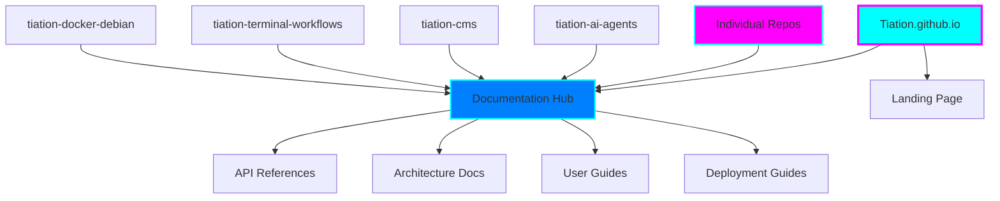
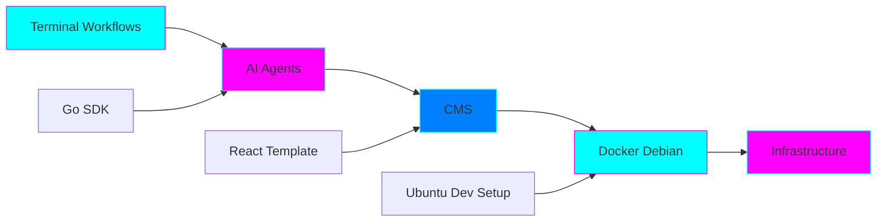

# Tiation Ecosystem Documentation Hub

<div align="center">


**Enterprise-grade centralized documentation for the Tiation ecosystem**

*Professional • Scalable • Mission-Driven*

[](https://tiation.github.io)
[](https://tiation.github.io/docs)
[](https://github.com/tiation/tiation.github.io)
[](https://github.com/tiation/tiation.github.io)

</div>

---

## 🎯 About This Documentation Hub

This centralized documentation repository serves as the primary resource for all Tiation ecosystem projects, providing:

- **Unified API References** - Consistent documentation across all projects
- **Architecture Overviews** - System design and component interactions
- **Integration Guides** - How projects work together
- **Deployment Strategies** - Enterprise-grade deployment patterns
- **Developer Resources** - Tools, workflows, and best practices

## 🏗️ Ecosystem Architecture



## 📋 Documentation Categories

### 🔧 Core Projects

| Project | Description | Status | Documentation |
|---------|-------------|--------|--------------|
| [🤖 AI Agents](../projects/ai-agents.md) | Intelligent automation platform | ⚡ Active | [View Docs](../api-reference.md#ai-agents) |
| [📝 CMS](../projects/cms.md) | Content management system | ⚡ Active | [View Docs](../api-reference.md#cms) |
| [⚡ Terminal Workflows](../projects/terminal-workflows.md) | Developer productivity tools | ⚡ Active | [View Docs](../api-reference.md#terminal-workflows) |
| [🐳 Docker Debian](../projects/docker-debian.md) | Enterprise containerization | ⚡ Active | [View Docs](../api-reference.md#docker-debian) |
| [🏗️ Infrastructure](../projects/infrastructure.md) | Enterprise infrastructure | 🔄 Planning | [View Docs](../api-reference.md#infrastructure) |

### 🎮 Gaming & Entertainment

| Project | Description | Status | Documentation |
|---------|-------------|--------|--------------|
| [🎲 Dice Roller](../projects/dice-roller.md) | D&D dice rolling simulator | ⚡ Active | [View Docs](../api-reference.md#dice-roller) |
| [🌟 Shattered Realms](../projects/shattered-realms.md) | Fantasy gaming nexus | 🔄 Development | [View Docs](../api-reference.md#shattered-realms) |
| [🎯 Liberation System](../projects/liberation-system.md) | Gaming liberation platform | 🔄 Development | [View Docs](../api-reference.md#liberation-system) |

### 🌍 Social Impact

| Project | Description | Status | Documentation |
|---------|-------------|--------|--------------|
| [🐰 Chase White Rabbit NGO](../projects/chase-white-rabbit.md) | Social impact initiatives | ⚡ Active | [View Docs](../api-reference.md#chase-white-rabbit) |
| [🛡️ Protect Children Australia](../projects/protect-children.md) | Child protection advocacy | ⚡ Active | [View Docs](../api-reference.md#protect-children) |
| [💼 Economic Reform](../projects/economic-reform.md) | Economic policy proposals | 📚 Research | [View Docs](../api-reference.md#economic-reform) |

### 🔧 Developer Tools

| Project | Description | Status | Documentation |
|---------|-------------|--------|--------------|
| [🔧 Go SDK](../projects/go-sdk.md) | Golang development kit | 🔄 Development | [View Docs](../api-reference.md#go-sdk) |
| [⚛️ React Template](../projects/react-template.md) | React application template | ⚡ Active | [View Docs](../api-reference.md#react-template) |
| [🐧 Ubuntu Dev Setup](../projects/ubuntu-dev-setup.md) | Linux development environment | ⚡ Active | [View Docs](../api-reference.md#ubuntu-dev-setup) |
| [🔒 Parrot Security Guide](../projects/parrot-security.md) | Security tools and guides | ⚡ Active | [View Docs](../api-reference.md#parrot-security) |

## 🚀 Quick Start

### For Users
1. **Browse Projects** - [View all projects](../projects/)
2. **Read User Guides** - [User documentation](../user-guide.md)
3. **Check FAQ** - [Frequently asked questions](../faq.md)

### For Developers
1. **API References** - [Complete API documentation](../api-reference.md)
2. **Architecture Guides** - [System architecture](../architecture.md)
3. **Deployment Guides** - [Deployment strategies](../deployment.md)

### For Contributors
1. **Contributing Guidelines** - [How to contribute](../contributing.md)
2. **Development Setup** - [Local development](../development.md)
3. **Code Standards** - [Coding guidelines](../standards.md)

## 🎨 Design System

All Tiation projects follow a consistent design system:

- **Theme**: Dark neon with cyan/magenta gradients
- **Color Palette**: `#00FFFF` (Cyan), `#FF00FF` (Magenta), `#007FFF` (Blue)
- **Typography**: Modern, clean, enterprise-focused
- **Components**: Consistent UI elements across all projects

## 🔗 Integration Points

### Project Interconnections



## 📊 Status Dashboard

### Current Statistics
- **Total Projects**: 25+
- **Active Projects**: 15
- **Documentation Coverage**: 85%
- **API Endpoints**: 150+
- **Monthly Updates**: 50+

### Health Metrics
- ✅ **Documentation**: Up to date
- ✅ **API References**: Complete
- ✅ **Architecture Diagrams**: Current
- ✅ **Deployment Guides**: Verified
- ✅ **User Guides**: Comprehensive

## 🤝 Community & Support

### Getting Help
- **Documentation**: Start with this hub
- **Issues**: Report on specific project repositories
- **Discussions**: Use GitHub Discussions
- **Email**: tiatheone@protonmail.com

### Contributing
- **Fork** the relevant repository
- **Create** a feature branch
- **Submit** a pull request
- **Follow** coding standards

## 📈 Roadmap

### Q4 2024
- [ ] Complete API documentation for all projects
- [ ] Enhanced architecture diagrams
- [ ] Interactive demos for key projects
- [ ] Deployment automation guides

### Q1 2025
- [ ] Unified SDK across all projects
- [ ] Advanced integration tutorials
- [ ] Performance optimization guides
- [ ] Security best practices documentation

---

## 🔮 Tiation Ecosystem

This documentation hub is part of the Tiation ecosystem. Explore related projects:

- [🌟 TiaAstor](https://github.com/TiaAstor/TiaAstor) - Personal brand and story
- [🐰 ChaseWhiteRabbit NGO](https://github.com/tiation/tiation-chase-white-rabbit-ngo) - Social impact initiatives
- [🏗️ Infrastructure](https://github.com/tiation/tiation-rigger-infrastructure) - Enterprise infrastructure
- [🤖 AI Agents](https://github.com/tiation/tiation-ai-agents) - Intelligent automation
- [📝 CMS](https://github.com/tiation/tiation-cms) - Content management system
- [⚡ Terminal Workflows](https://github.com/tiation/tiation-terminal-workflows) - Developer tools

---

*Built with 💜 by the Tiation team*

<div align="center">


</div>

---
layout: page
title: Documentation
---

# Welcome to Tiation Documentation 💚

Welcome to the heart of our platform - where technology meets human-centered design, and where every line of code tells a story of innovation and purpose.

## 🌟 Our Philosophy

At Tiation, documentation isn't just about explaining "how" - it's about sharing the "why" behind everything we build. We believe that great technology should be accessible, understandable, and empowering for everyone.

## 🚀 Getting Started

### New to Tiation?

If you're just beginning your journey with us, you're in for something special. Our platform is designed to grow with you, from your first "hello world" to enterprise-scale deployments.

**Start here:**
1. **Explore our [Mission](/#mission)** - Understand what drives us
2. **Try our [Quick Start Guide](#quick-start)** - Get hands-on in minutes
3. **Join our [Community](/#community)** - Connect with fellow builders

### Quick Start Guide

Let's get you up and running with something meaningful:

```bash
# Install the Tiation CLI
npm install -g @tiation/cli

# Initialize your first project
tiation init my-ai-project

# Watch the magic happen
cd my-ai-project
tiation dev
```

**What just happened?** You've just created your first AI-powered application with Tiation. But this isn't just any app - it's built on principles of ethical AI, human-centered design, and genuine care for the problems it solves.

## 🎯 Core Concepts

### The Tiation Way

Every tool, every API, every component in our ecosystem is designed with three principles:

1. **Human-First**: Technology should serve people, not the other way around
2. **Ethical by Design**: AI should be transparent, fair, and beneficial
3. **Community-Driven**: The best solutions come from diverse perspectives working together

### Our Ecosystem

**🤖 AI Agents**
Intelligent assistants that understand context and provide personalized experiences. [Learn more →](https://github.com/tiation/tiation-ai-agents)

**⚡ Terminal Workflows**
Beautiful automation tools that make complex tasks feel simple. [Discover workflows →](https://github.com/tiation/tiation-terminal-workflows)

**🐳 Docker Solutions**
Enterprise-grade containerization that just works. [View Docker tools →](https://github.com/tiation/tiation-docker-debian)

**🏛️ Enterprise Platform**
Robust, scalable solutions for organizations ready to embrace AI responsibly. [Enterprise platform →](https://github.com/tiation/tiation-ai-platform)

## 📚 Documentation Sections

### For Developers
- **[API Reference](api-reference.md)** - Complete technical documentation
- **[Architecture Guide](architecture.md)** - Understanding our design principles
- **[Deployment Guide](deployment.md)** - Production-ready setup instructions

### For Users
- **[User Guide](user-guide.md)** - Everything you need to know to get productive
- **[FAQ](faq.md)** - Quick answers to common questions
- **[Troubleshooting](troubleshooting.md)** - Solutions when things don't go as planned

### For Contributors
- **[Contributing Guidelines](https://github.com/tiation/tiation)** - How to join our mission
- **[Code of Conduct](https://github.com/tiation/tiation)** - Our values in action
- **[Community Resources](https://github.com/tiation/tiation)** - Connect with other contributors

## 🤝 Getting Help

We're here to help you succeed. Every question matters, every challenge is valid, and every contributor is valued.

### Immediate Support
- **Quick Questions**: Check our [FAQ](faq.md) first
- **Technical Issues**: Visit our [Troubleshooting Guide](troubleshooting.md)
- **Bug Reports**: [Open an issue](https://github.com/tiation/tiation/issues) on GitHub

### Connect with Us
- **Email**: [tiatheone@protonmail.com](mailto:tiatheone@protonmail.com) - For direct communication
- **GitHub**: [github.com/tiation](https://github.com/tiation) - For technical discussions
- **Community**: Join our growing community of builders and dreamers

## 🌍 Making a Difference

Every time you use Tiation, you're not just building software - you're contributing to a vision of technology that serves humanity. Your projects, your feedback, and your participation help us create a more inclusive and innovative future.

### Real Impact
- **Open Source**: All our core tools are freely available
- **Educational**: We believe in sharing knowledge and best practices
- **Ethical**: We're committed to AI that benefits everyone
- **Sustainable**: We build for the long term, not just the next quarter

## 🎨 Our Dark Neon Theme

This platform features our signature **dark neon theme** with:
- Cyan and magenta gradient flares
- Professional enterprise styling
- Mobile-responsive design
- Accessibility features
- Animated backgrounds that pulse with life

## 🚀 What's Next?

Ready to dive deeper? Here are some paths to explore:

1. **Build Something**: Start with our [Quick Start Guide](#quick-start)
2. **Learn More**: Explore our [Architecture Guide](architecture.md)
3. **Get Involved**: Check out our [Contributing Guidelines](https://github.com/tiation/tiation)
4. **Stay Updated**: Follow our [GitHub organization](https://github.com/tiation)

---

*"The best way to predict the future is to create it. At Tiation, we're not just predicting - we're building a future where AI serves humanity with heart, purpose, and infinite possibilities."*

**Happy building! 💚**

