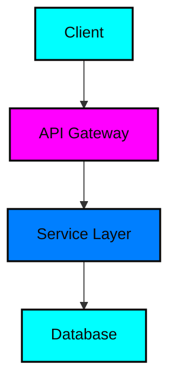

# [PROJECT_NAME]

<div align="center">


**[PROJECT_DESCRIPTION]**

*Professional • Scalable • Mission-Driven*

[](https://[DEMO_URL])
[](https://[DOCS_URL])
[](https://[REPO_URL])
[](https://[REPO_URL])

</div>

---

## 🎯 Overview

[Brief description of what this project does and why it exists]

## 🏗️ Architecture

<div align="center">



*Architecture Overview - [Add detailed architecture diagram]*

</div>

## ✨ Features

- 🚀 **Performance**: High-performance implementation with optimized algorithms
- 🔒 **Security**: Enterprise-grade security measures
- 📊 **Monitoring**: Built-in metrics and monitoring
- 🔧 **Extensible**: Modular architecture for easy customization
- 🌐 **Cross-Platform**: Works across multiple platforms and environments

## 🚀 Quick Start

### Prerequisites

- [List prerequisites]
- [Version requirements]

### Installation

```bash
# Clone the repository
git clone https://github.com/tiation/[PROJECT_NAME].git
cd [PROJECT_NAME]

# Install dependencies
[INSTALL_COMMANDS]

# Run the application
[RUN_COMMANDS]
```

### Docker Deployment

```bash
# Build the Docker image
docker build -t tiation/[PROJECT_NAME] .

# Run with Docker Compose
docker-compose up -d
```

## 📚 Documentation

### API Documentation

- [📖 API Reference](docs/api/README.md)
- [🔗 OpenAPI Spec](docs/api/openapi.yaml)
- [📝 Examples](docs/examples/)

### Guides

- [🚀 Getting Started](docs/getting-started.md)
- [🔧 Configuration](docs/configuration.md)
- [🏗️ Architecture](docs/architecture.md)
- [🔒 Security](docs/security.md)
- [📊 Monitoring](docs/monitoring.md)

## 🎮 Interactive Demo

<div align="center">

[](https://[DEMO_VIDEO_URL])

*Click above to watch our interactive demo*

</div>

### Live Demo Features

- Real-time functionality demonstration
- Interactive API playground
- Performance metrics visualization
- Security feature showcase

## 🔧 Configuration

### Environment Variables

```bash
# Core Configuration
API_KEY=your_api_key_here
DATABASE_URL=your_database_url
PORT=3000

# Security
JWT_SECRET=your_jwt_secret
ENCRYPTION_KEY=your_encryption_key

# Monitoring
METRICS_ENABLED=true
LOG_LEVEL=info
```

### Configuration Files

- `config/production.json` - Production configuration
- `config/development.json` - Development configuration
- `config/test.json` - Testing configuration

## 🧪 Testing

```bash
# Run all tests
npm test

# Run with coverage
npm run test:coverage

# Run specific test suite
npm run test:unit
npm run test:integration
npm run test:e2e
```

## 📊 Monitoring & Metrics

### Health Checks

```bash
# Check application health
curl http://localhost:3000/health

# Check detailed metrics
curl http://localhost:3000/metrics
```

### Dashboard

Access the monitoring dashboard at: [MONITORING_URL]

## 🤝 Contributing

We welcome contributions! Please see our [Contributing Guide](CONTRIBUTING.md) for details.

### Development Setup

```bash
# Fork and clone the repository
git clone https://github.com/YOUR_USERNAME/[PROJECT_NAME].git
cd [PROJECT_NAME]

# Install development dependencies
npm install

# Run development server
npm run dev
```

### Code Style

- Follow our [Code Style Guide](docs/code-style.md)
- Use ESLint and Prettier for formatting
- Write meaningful commit messages

## 📄 License

This project is licensed under the MIT License - see the [LICENSE](LICENSE) file for details.

## 🔮 Tiation Ecosystem

This repository is part of the Tiation ecosystem. Explore related projects:

- [🌟 TiaAstor](https://github.com/TiaAstor/TiaAstor) - Personal brand and story
- [🐰 ChaseWhiteRabbit NGO](https://github.com/tiation/tiation-chase-white-rabbit-ngo) - Social impact initiatives
- [🏗️ Infrastructure](https://github.com/tiation/tiation-rigger-infrastructure) - Enterprise infrastructure
- [🤖 AI Agents](https://github.com/tiation/tiation-ai-agents) - Intelligent automation
- [📝 CMS](https://github.com/tiation/tiation-cms) - Content management system
- [⚡ Terminal Workflows](https://github.com/tiation/tiation-terminal-workflows) - Developer tools

## 🆘 Support

- 📧 Email: [EMAIL_ADDRESS]
- 💬 Discord: [DISCORD_INVITE]
- 📱 Twitter: [@tiation](https://twitter.com/tiation)
- 📖 Documentation: [DOCS_URL]

---

<div align="center">

*Built with 💜 by the Tiation team*

[](https://github.com/tiation)

</div>
